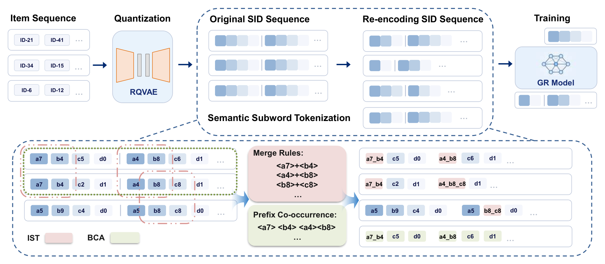

# Semantic Subword Tokenization

Semantic Subword Tokenization (SST) is a history-side tokenization and augmentation method for generative recommendation. It starts from fixed-length semantic IDs, learns reusable semantic subwords, and uses behavior-derived replay examples to enrich training while keeping the prediction target in the original SID space.



[View the original method figure (PDF)](docs/assets/sst_method_overview.pdf)

## Method Overview

A conventional generative recommender represents each item as a fixed sequence of semantic tokens, such as `<a_i><b_j><c_k><d_l>`. SST has two components:

- **Item-level subword tokenization (IST):** identifies recurring semantic substructures in item identifiers and uses them to form a more compact, semantically coherent representation of user histories without changing the prediction space.
- **Behavior-induced co-occurrence augmentation (BCA):** leverages regularities in user behavior to enrich the training signal, strengthening associations between related interests while leaving the evaluation protocol unchanged.


## Example Data

`data/Beauty_TIGER/` is a runnable Beauty/TIGER example. It contains the source artifacts needed to reproduce the workflow below:

```text
Beauty.index.json       # item ID -> fixed-length TIGER RQVAE SID tokens
Beauty.inter.json       # chronological user interaction sequences
Beauty.sid2pid.json     # fixed SID -> item candidates for PID evaluation
train_data.json         # corpus used to learn IST merge rules
```

The example has 12,101 items and 22,363 user histories.

## Installation

Install a PyTorch build compatible with the local CUDA environment, then install the remaining dependencies:

```bash
pip install -r requirements.txt
```

## Base: Fixed SID

Generate fixed-SID seq2seq splits in the example data directory:

```bash
python tools/build_seq2seq_sliding_dataset.py \
  --output-dir data/Beauty_TIGER \
  --inter-path data/Beauty_TIGER/Beauty.inter.json \
  --history-index-path data/Beauty_TIGER/Beauty.index.json \
  --target-index-path data/Beauty_TIGER/Beauty.index.json \
  --prefix seq2seq_letter \
  --max-history-items 20
```

This creates `train_seq2seq_letter.json`, `val_seq2seq_letter.json`, and `test_seq2seq_letter.json`, matching `pretrain_config/Beauty_TIGER_seq2seq_t5-rec.yaml`.

```bash
python train_single.py \
  --dataset Beauty_TIGER \
  --model_name seq2seq_t5-rec

python evaluate_single.py \
  --dataset Beauty_TIGER \
  --model_name seq2seq_t5-rec \
  --checkpoint experiment/<RUN_DIR>/best_model \
  --eval_split test \
  --generation_constraint full_trie
```

## SST: IST + Behavior Replay

### 1. Learn and apply semantic subwords

```bash
python tools/build_varlen_sid_index.py \
  --input-dir data/Beauty_TIGER \
  --output-dir data/Beauty_TIGER_varlen \
  --selection-strategy bpe \
  --top-k 128 \
  --min-weighted-freq 20 \
  --min-item-support 10 \
  --overwrite
```

This generates the variable-length index, rewritten training corpus, SID mapping, and `varlen_meta.json` under `data/Beauty_TIGER_varlen/`.

### 2. Build variable-history, fixed-target splits

```bash
python tools/build_seq2seq_sliding_dataset.py \
  --output-dir data/Beauty_TIGER_varlen \
  --inter-path data/Beauty_TIGER/Beauty.inter.json \
  --history-index-path data/Beauty_TIGER_varlen/Beauty.index.json \
  --target-index-path data/Beauty_TIGER/Beauty.index.json \
  --prefix seq2seq_letter_fixed_target \
  --max-history-items 20
```

### 3. Add behavior replay to training only

```bash
python tools/build_prefix_pair_augmentation.py \
  --source-dataset-dir data/Beauty_TIGER \
  --target-train-files data/Beauty_TIGER_varlen/train_seq2seq_letter_fixed_target.json \
  --output-suffix _behseq \
  --augmentation-mode sequence_replay \
  --prefix-tokens 2 \
  --window-size 3 \
  --top-k 256 \
  --min-count 10 \
  --max-augmentations-per-pair 50
```

The final training file is `data/Beauty_TIGER_varlen/train_seq2seq_letter_fixed_target_behseq.json`. Validation and test remain the unaugmented fixed-target splits.

```bash
python train_single.py \
  --dataset Beauty_TIGER_varlen \
  --model_name seq2seq_t5-rec

python evaluate_single.py \
  --dataset Beauty_TIGER_varlen \
  --model_name seq2seq_t5-rec \
  --checkpoint experiment/<RUN_DIR>/best_model \
  --eval_split test \
  --generation_constraint full_trie
```

`pretrain_config/Beauty_TIGER_varlen_seq2seq_t5-rec.yaml` is preconfigured for these generated paths.

## Repository Layout

```text
.
├── data/Beauty_TIGER/                       # tracked Beauty/TIGER example source data
├── docs/assets/                              # SST method figure (PNG and PDF)
├── pretrain_config/
│   ├── Beauty_TIGER_seq2seq_t5-rec.yaml    # fixed-SID base
│   └── Beauty_TIGER_varlen_seq2seq_t5-rec.yaml # generated SST data
├── util/                                     # tokenization, collation, runtime, and evaluation helpers
├── quantization/                             # optional semantic-ID preparation utilities
├── tools/
│   ├── build_varlen_sid_index.py
│   ├── build_seq2seq_sliding_dataset.py
│   └── build_prefix_pair_augmentation.py
├── train_single.py
└── evaluate_single.py
```

